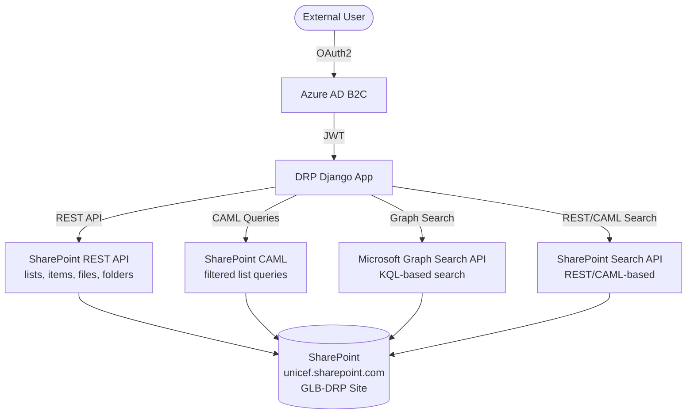

# Architecture

## Overview



## Authentication Flow

1. User authenticates via **Azure AD B2C** (social login) using `UNICEFAzureADB2COAuth2` from `unicef-security` 1.10
2. A JWT token is issued and sent with each request
3. DRP validates the token and resolves the user's donor roles
4. `DonorPermission` / `PublicLibraryPermission` guards enforce access to specific SharePoint libraries

## API Layer

The API is built with **Django REST Framework 3.17** and organised into viewsets under `api/views/`. Each SharePoint access mechanism has both **URL-based** (dynamic tenant/site) and **Settings-based** (config-driven) variants.

See [SharePoint Access](sharepoint.md) for endpoint details.

## Integrations

### SharePoint
SharePoint integration uses `sharepoint-rest-api` 0.20 for REST/CAML/Graph operations and `Office365-REST-Python-Client` 2.6 for lower-level SharePoint interaction. A `SharePointClient` class wraps common operations (`read_folder`, `read_items`, `read_caml_items`, `read_file`, `download_file`). Custom serializer fields (`SharePointPropertyField`, `SharePointPropertyManyField`) expose SharePoint list properties as DRF fields.

### Insight
Donor, Grant, External Grant, and Theme metadata are synchronised from the **dsgrants** service in UNICEF Insight via `GrantSynchronizer` (extends `VisionDataSynchronizer` from `unicef-vision` 0.6).

### Notifications
On user creation, a welcome email is triggered using `unicef-notification` 1.4.

## Metadata Models

| Model | Description |
|---|---|
| `Theme` | Thematic area classification |
| `Donor` | Donor organisation |
| `Grant` | Grant/funding details |
| `ExternalGrant` | External grant reference data |

Static hard-coded metadata is also used for certain lookups.

## Project Layout

```
src/donor_reporting_portal/
├── api/                  # REST API layer
│   ├── views/            # DRF viewsets
│   ├── serializers/      # Request/response serializers
│   ├── permissions.py    # Permission classes
│   ├── filters.py        # Query filters
│   └── urls.py           # API route definitions
├── apps/                 # Django apps
│   ├── core/             # Core app (backends, fixtures, management commands)
│   ├── report_metadata/  # Donor/grant metadata + Insight synchronisers
│   ├── roles/            # User roles & permissions
│   └── sharepoint/       # SharePoint integration (models, admin)
├── config/               # Django settings
│   ├── settings.py
│   ├── urls.py
│   ├── celery.py
│   └── fragments/        # Modular settings (drp.py, insight.py, ...)
└── libs/                 # Shared utilities
```
